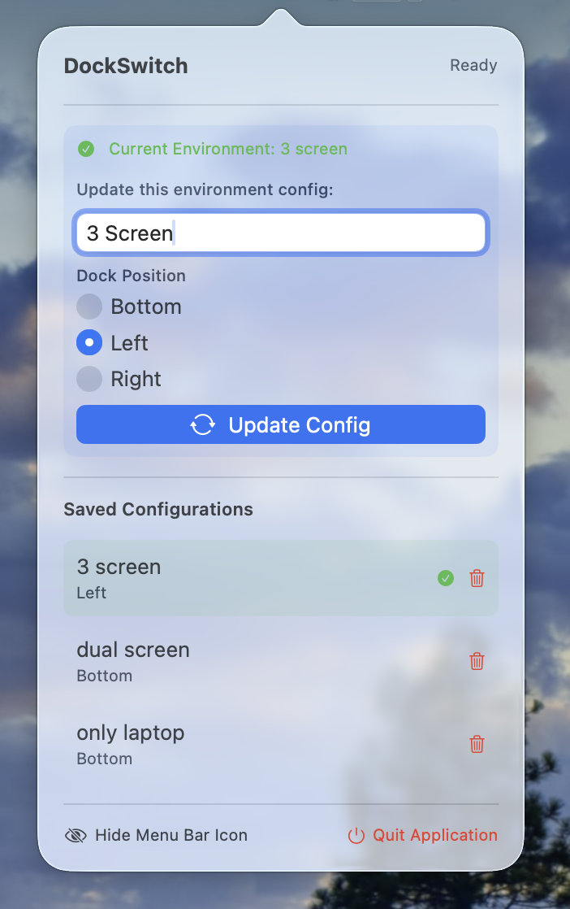

# DockSwitch

[English](#english) | [中文](#中文)

<div align="center">
  
  
  
</div>

<div align="center">
  
  
  <p><small>Showcase / 截图</small></p>
</div>

---

## English

### 📖 Overview

**DockSwitch** is a lightweight macOS menu bar app that automatically adjusts your Dock position based on display configuration. Perfect for multi-monitor setups.

### ✨ Features

- 🔄 **Auto-Switch** - Automatically changes Dock position when displays change
- 💾 **Multiple Profiles** - Save unlimited configurations for different setups
- 🌐 **Bilingual** - English and Chinese support
- 🎯 **Simple** - Clean menu bar interface
- ⚡ **Lightweight** - Minimal resource usage

### 📋 Requirements

- macOS 13.0 (Ventura) or later
- Automation permission for System Events

### 🚀 Installation

Download from [Releases](https://github.com/VellerRider/DockSwitch/releases) or build from source:

```bash
git clone https://github.com/VellerRider/DockSwitch.git
cd DockSwitch
open DockSwitch.xcodeproj
# Build and run (⌘R)
```

⚠️ **First launch**: Right-click > Open (don't double-click due to macOS security)

### 🎯 Usage

1. **Launch** - App appears in menu bar
2. **Grant Permission** - Allow System Events control when prompted
3. **Create Config** - Name your setup and choose Dock position
4. **Auto-Switch** - Dock moves automatically when displays change

### 🔧 Technical Details

- **Screen Fingerprinting**: Identifies displays by name + resolution
- **Dock Control**: Uses AppleScript for smooth position changes
- **Storage**: Configurations saved in UserDefaults

### 🤝 Contributing

Contributions welcome! Submit issues or pull requests.

### 📄 License

MIT License - see [LICENSE](LICENSE) file.

---

## 中文

### 📖 简介

**DockSwitch** 是一款轻量级 macOS 菜单栏应用，可根据显示器配置自动调整程序坞位置。非常适合多显示器用户。

### ✨ 主要特性

- 🔄 **自动切换** - 显示器变化时自动更改程序坞位置
- 💾 **多配置** - 为不同设置保存无限数量的配置
- 🌐 **双语** - 支持英文和简体中文
- 🎯 **简洁** - 清爽的菜单栏界面
- ⚡ **轻量** - 资源占用最小

### 📋 系统要求

- macOS 13.0 (Ventura) 或更高版本
- 系统事件的自动化权限

### 🚀 安装方法

从 [Releases](https://github.com/VellerRider/DockSwitch/releases) 下载或从源码构建：

```bash
git clone https://github.com/VellerRider/DockSwitch.git
cd DockSwitch
open DockSwitch.xcodeproj
# 构建并运行 (⌘R)
```

⚠️ **首次运行**: 右键点击 > 打开（不要双击，由于 macOS 安全机制）

### 🎯 使用方法

1. **启动** - 应用出现在菜单栏
2. **授予权限** - 在提示时允许控制系统事件
3. **创建配置** - 为当前设置命名并选择程序坞位置
4. **自动切换** - 显示器变化时程序坞自动移动

### 🔧 技术细节

- **屏幕指纹**: 通过名称 + 分辨率识别显示器
- **程序坞控制**: 使用 AppleScript 平滑切换位置
- **存储**: 配置保存在 UserDefaults 中

### 🤝 贡献

欢迎贡献！请提交问题或拉取请求。

### 📄 许可证

MIT 许可证 - 详见 [LICENSE](LICENSE) 文件。

---

<div align="center">
  Made with ❤️ for macOS multi-monitor users<br>
  为多显示器 macOS 用户用心打造
</div>
